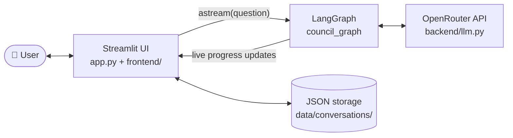
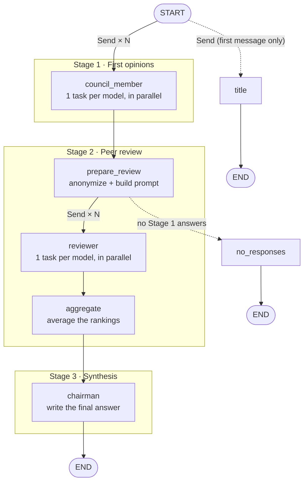

# 🏛️ LLM Council


**Don't ask one AI — ask a council of them.**

LLM Council sends your question to several leading models at once (GPT, Gemini, Claude, Grok), has them **anonymously review and rank each other's answers**, and then a **Chairman** model combines the best of everything into one final answer.

Built with **[LangGraph](https://langchain-ai.github.io/langgraph/)** (backend workflow) and **[Streamlit](https://streamlit.io/)** (chat interface), using **[OpenRouter](https://openrouter.ai/)** to reach all models with a single API key.

---

## ✨ How it works

Every question goes through three stages:

| Stage | What happens | What you see |
|---|---|---|
| **1. First opinions** | Every council model answers your question independently, all at the same time. | One tab per model with its full answer. |
| **2. Peer review** | Each model gets all the answers, labelled only as *Response A, B, C…*, so it can't tell which model wrote which (no playing favourites). It evaluates them and ranks them best to worst. | Each model's review, the ranking extracted from it, and a combined **leaderboard**. |
| **3. Final answer** | The Chairman model reads every answer and every review, then writes one final response. | The final answer, shown front and centre. |


If a model fails or times out, the council simply continues without it. You'll see a warning naming the model that was skipped.

---

## 🚀 Quick start

### Prerequisites

- **Python 3.10+**
- **[uv](https://docs.astral.sh/uv/getting-started/installation/)** (Python package manager)
- An **[OpenRouter API key](https://openrouter.ai/keys)** with some credits

### 1. Clone the repository

```bash
git clone https://github.com/HARSHITH-1210/Council-of-AI.git
cd Council-of-AI
```

### 2. Install dependencies

```bash
uv sync
```

### 3. Add your API key

Create a file named `.env` in the project folder:

```bash
OPENROUTER_API_KEY=sk-or-v1-your-key-here
```

> `.env` is listed in `.gitignore`, so your key is never committed.

### 4. Run the app

```bash
uv run streamlit run app.py
```

Open **http://localhost:8501** in your browser and ask your first question.

---

## 🖥️ Using the app

- **Ask a question** in the chat box at the bottom. You'll see live progress as each model answers and reviews.
- **Stage 1 / Stage 2** are collapsible sections. Click a model's tab to read its answer or review.
- In Stage 2, model names appear in **bold** for readability, but the models themselves only ever saw anonymous labels.
- **Sidebar:** start a new conversation, switch between past conversations, or view the current council members.
- **🗑️ Delete** removes the conversation you're viewing.

Conversations are saved locally as JSON files in `data/conversations/`.

---

## ⚙️ Configuration

All settings live in [`backend/config.py`](backend/config.py):

```python
COUNCIL_MODELS = [                       # who answers and reviews
    "openai/gpt-5.1",
    "google/gemini-3-pro-preview",
    "anthropic/claude-sonnet-4.5",
    "x-ai/grok-4",
]
CHAIRMAN_MODEL = "google/gemini-3-pro-preview"   # writes the final answer
TITLE_MODEL = "google/gemini-2.5-flash"          # names your conversations
```

- Use any model ID from **[openrouter.ai/models](https://openrouter.ai/models)**.
- Models with IDs ending in `:free` cost nothing, which is handy for testing.
- The council can have any number of members, and the Chairman can be a member too.

---

## 🧱 Project structure

```
Council-of-AI/
├── app.py                  # Streamlit entry point: page, sidebar, chat box
├── frontend/
│   ├── components.py       # Displays Stage 1, 2 and 3 results
│   └── runner.py           # Runs the graph and streams live progress to the UI
├── backend/
│   ├── graph.py            # LangGraph workflow: state, nodes, edges
│   ├── prompts.py          # Prompt text for each stage
│   ├── rankings.py         # Anonymization, ranking parsing, leaderboard maths
│   ├── llm.py              # OpenRouter API client
│   ├── storage.py          # Saves conversations as JSON
│   └── config.py           # Models, API key, settings
├── pyproject.toml          # Dependencies
└── .env                    # Your API key (create this yourself, not committed)
```

---

## 🧠 Graph architecture

The backend is a single LangGraph **`StateGraph`** defined in [`backend/graph.py`](backend/graph.py) and compiled once as `council_graph`. The Streamlit app calls it directly, with no web server or API in between.

### System overview



### The workflow graph



Solid arrows are the normal path. Dotted arrows are optional branches.

### Nodes

| Node | Kind | What it does | Writes to state |
|---|---|---|---|
| `council_member` | LLM call, once per model | Sends the user's question to one council model | `stage1` (or `failed_models`) |
| `title` | LLM call | Generates a 3–5 word conversation title (first message only) | `title` |
| `prepare_review` | Python | Waits for all Stage 1 answers, labels them *Response A, B, C…*, and builds one shared review prompt | `label_to_model`, `ranking_prompt` |
| `reviewer` | LLM call, once per model | One model evaluates and ranks the anonymized answers; the ranking is parsed from its `FINAL RANKING:` section | `stage2` (or `failed_models`) |
| `aggregate` | Python | Averages each model's position across all reviews (lower is better) | `aggregate_rankings` |
| `chairman` | LLM call | The Chairman writes the final answer from all answers and reviews | `stage3` |
| `no_responses` | Python | Fallback when every model failed in Stage 1 | `stage3` (error message) |

### Routing

| From | Router function | Goes to |
|---|---|---|
| `START` | `dispatch_council` | One `Send("council_member")` per model, plus `Send("title")` on the first message of a conversation |
| `prepare_review` | `dispatch_reviewers` | One `Send("reviewer")` per model, or `no_responses` if Stage 1 produced nothing |

All other edges are fixed. `Send` is LangGraph's way of launching the **same node several times in parallel**, each with its own input (here, `{model, prompt}`).

### State (`CouncilState`)

| Key | Written by | How updates combine |
|---|---|---|
| `user_query`, `generate_title` | Input | — |
| `stage1` | `council_member` | **Merged** from all parallel tasks, kept in `COUNCIL_MODELS` order |
| `stage2` | `reviewer` | **Merged** the same way |
| `failed_models` | `council_member`, `reviewer` | **Appended** (`operator.add`) |
| `label_to_model`, `ranking_prompt` | `prepare_review` | Overwritten |
| `aggregate_rankings` | `aggregate` / `no_responses` | Overwritten |
| `stage3` | `chairman` / `no_responses` | Overwritten |
| `title` | `title` | Overwritten |

Parallel tasks write to the same key at the same moment, so `stage1`, `stage2` and `failed_models` use **reducers** that combine the results instead of overwriting them.

### How a run executes

LangGraph runs the graph in **supersteps**. All tasks in a step run concurrently, and the next step starts once they have all finished.

| Step | Runs | Waiting on LLMs? |
|---|---|---|
| 1 | `council_member` × 4 **and** `title`, in parallel | ✅ |
| 2 | `prepare_review` | — |
| 3 | `reviewer` × 4, in parallel | ✅ |
| 4 | `aggregate` | — |
| 5 | `chairman` | ✅ |

With 4 council models, one question makes **10 LLM calls** (4 answers + 4 reviews + 1 chairman + 1 title) but only **3 rounds of waiting**, because each round runs in parallel.

### Streaming to the UI

[`frontend/runner.py`](frontend/runner.py) runs the graph with `council_graph.astream(inputs, stream_mode=["updates", "values"])`:

- **`updates`** emits an event each time a node finishes, which becomes a live progress line (e.g. *"✅ Stage 1 · gpt-5.1 answered"*).
- **`values`** emits the full state after each step; the last one is the final result that gets saved.

### Failure handling

- If a model errors or times out, `query_model` returns `None`, the node records the model in `failed_models`, and the graph carries on without it.
- If some reviewers fail, the leaderboard is built from the reviews that did arrive.
- If **every** model fails in Stage 1, the graph routes to `no_responses` and shows an error.
- If the chairman fails, Stage 3 shows an error message, but the Stage 1 and 2 results are still displayed.

---

## 🛠️ Troubleshooting

| Problem | Fix |
|---|---|
| **"OPENROUTER_API_KEY is not set"** | Create `.env` in the project folder (see step 3), then restart the app. |
| **"All models failed to respond"** | Check that your key is valid and has credits at [openrouter.ai](https://openrouter.ai/). The terminal shows the exact error for each model (e.g. `401 Unauthorized`). |
| **One model always fails** | Its ID may have been renamed or retired. Look it up on [openrouter.ai/models](https://openrouter.ai/models) and update `backend/config.py`. |
| **`ModuleNotFoundError: backend`** | Run the command from the project's root folder, not from inside `backend/` or `frontend/`. |

---

## 🙏 Credits

Inspired by [karpathy/llm-council](https://github.com/karpathy/llm-council), rebuilt here with a LangGraph backend and a Streamlit frontend.
