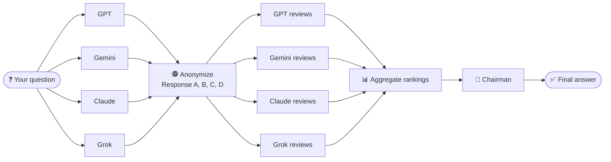
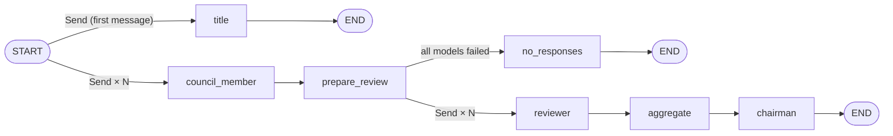

# 🏛️ LLM Council


**Don't ask one AI — ask a council of them.**

LLM Council sends your question to several leading models at once (GPT, Gemini, Claude, Grok), has them **anonymously review and rank each other's answers**, and then a **Chairman** model combines the best of everything into one final answer.

Built with **[LangGraph](https://langchain-ai.github.io/langgraph/)** (backend workflow) and **[Streamlit](https://streamlit.io/)** (chat interface), using **[OpenRouter](https://openrouter.ai/)** to reach all models with a single API key.

---

## ✨ How it works

Every question goes through three stages:

| Stage | What happens | What you see |
|---|---|---|
| **1. First opinions** | Every council model answers your question independently, all at the same time. | One tab per model with its full answer. |
| **2. Peer review** | Each model gets all the answers, labelled only as *Response A, B, C…*, so it can't tell which model wrote which (no playing favourites). It evaluates them and ranks them best to worst. | Each model's review, the ranking extracted from it, and a combined **leaderboard**. |
| **3. Final answer** | The Chairman model reads every answer and every review, then writes one final response. | The final answer, shown front and centre. |



If a model fails or times out, the council simply continues without it. You'll see a warning naming the model that was skipped.

---

## 🚀 Quick start

### Prerequisites

- **Python 3.10+**
- **[uv](https://docs.astral.sh/uv/getting-started/installation/)** (Python package manager)
- An **[OpenRouter API key](https://openrouter.ai/keys)** with some credits

### 1. Clone the repository

```bash
git clone https://github.com/HARSHITH-1210/Council-of-AI.git
cd Council-of-AI
```

### 2. Install dependencies

```bash
uv sync
```

### 3. Add your API key

Create a file named `.env` in the project folder:

```bash
OPENROUTER_API_KEY=sk-or-v1-your-key-here
```

> `.env` is listed in `.gitignore`, so your key is never committed.

### 4. Run the app

```bash
uv run streamlit run app.py
```

Open **http://localhost:8501** in your browser and ask your first question.

---

## 🖥️ Using the app

- **Ask a question** in the chat box at the bottom. You'll see live progress as each model answers and reviews.
- **Stage 1 / Stage 2** are collapsible sections. Click a model's tab to read its answer or review.
- In Stage 2, model names appear in **bold** for readability, but the models themselves only ever saw anonymous labels.
- **Sidebar:** start a new conversation, switch between past conversations, or view the current council members.
- **🗑️ Delete** removes the conversation you're viewing.

Conversations are saved locally as JSON files in `data/conversations/`.

---

## ⚙️ Configuration

All settings live in [`backend/config.py`](backend/config.py):

```python
COUNCIL_MODELS = [                       # who answers and reviews
    "openai/gpt-5.1",
    "google/gemini-3-pro-preview",
    "anthropic/claude-sonnet-4.5",
    "x-ai/grok-4",
]
CHAIRMAN_MODEL = "google/gemini-3-pro-preview"   # writes the final answer
TITLE_MODEL = "google/gemini-2.5-flash"          # names your conversations
```

- Use any model ID from **[openrouter.ai/models](https://openrouter.ai/models)**.
- Models with IDs ending in `:free` cost nothing, which is handy for testing.
- The council can have any number of members, and the Chairman can be a member too.

---

## 🧱 Project structure

```
Council-of-AI/
├── app.py                  # Streamlit entry point: page, sidebar, chat box
├── frontend/
│   ├── components.py       # Displays Stage 1, 2 and 3 results
│   └── runner.py           # Runs the graph and streams live progress to the UI
├── backend/
│   ├── graph.py            # LangGraph workflow: state, nodes, edges
│   ├── prompts.py          # Prompt text for each stage
│   ├── rankings.py         # Anonymization, ranking parsing, leaderboard maths
│   ├── llm.py              # OpenRouter API client
│   ├── storage.py          # Saves conversations as JSON
│   └── config.py           # Models, API key, settings
├── pyproject.toml          # Dependencies
└── .env                    # Your API key (create this yourself, not committed)
```

### Under the hood: the LangGraph workflow



- **`Send`** launches one `council_member` / `reviewer` task **per model in parallel**, so the total wait is about as long as the slowest model, not the sum of all of them.
- **`prepare_review`** waits for all Stage 1 answers, assigns the anonymous labels, and builds the review prompt.
- The app streams graph updates (`astream`) to show progress as each model finishes.

---

## 🛠️ Troubleshooting

| Problem | Fix |
|---|---|
| **"OPENROUTER_API_KEY is not set"** | Create `.env` in the project folder (see step 3), then restart the app. |
| **"All models failed to respond"** | Check that your key is valid and has credits at [openrouter.ai](https://openrouter.ai/). The terminal shows the exact error for each model (e.g. `401 Unauthorized`). |
| **One model always fails** | Its ID may have been renamed or retired. Look it up on [openrouter.ai/models](https://openrouter.ai/models) and update `backend/config.py`. |
| **`ModuleNotFoundError: backend`** | Run the command from the project's root folder, not from inside `backend/` or `frontend/`. |

---

## 🙏 Credits

Inspired by [karpathy/llm-council](https://github.com/karpathy/llm-council), rebuilt here with a LangGraph backend and a Streamlit frontend.
